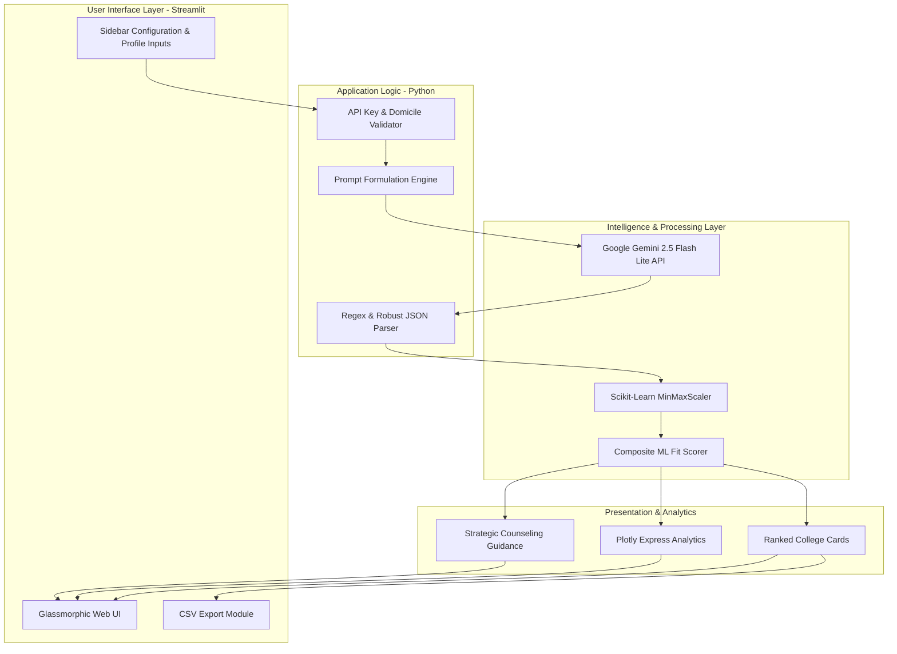
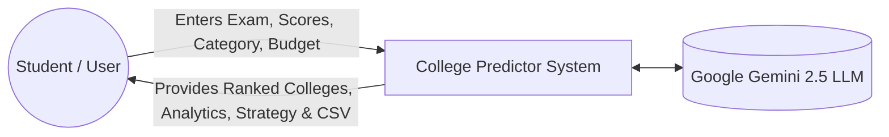
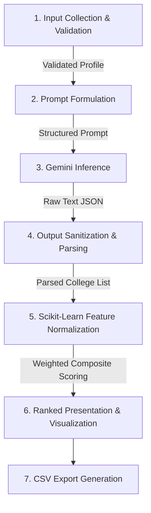
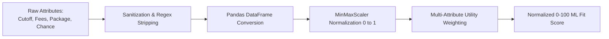

# 📘 PROJECT REPORT

## AI-Powered Engineering College Predictor & Counseling Recommendation System

**Academic Context**: Semester V / Mini-Project Report  
**Domain**: Artificial Intelligence, Machine Learning & Web Applications  
**Technologies**: Python, Streamlit, Google Gemini 2.5 Flash Lite, Scikit-Learn, Plotly  
**Author / Repository**: [Akash Chavan](https://github.com/akashchavan7913/College-Predictor-)  
**Date**: September 2026  

---

## 📑 TABLE OF CONTENTS

1. [Executive Summary / Abstract](#1-executive-summary--abstract)
2. [Chapter 1: Introduction](#chapter-1-introduction)
   - 1.1 Project Background & Context
   - 1.2 Problem Statement
   - 1.3 Project Objectives
   - 1.4 Scope and Limitations
3. [Chapter 2: Literature Survey & Comparative Analysis](#chapter-2-literature-survey--comparative-analysis)
   - 2.1 Overview of Current Admission Portals
   - 2.2 Shortcomings of Conventional Platforms
   - 2.3 Proposed Solution & Innovation
4. [Chapter 3: System Requirements & Architecture](#chapter-3-system-requirements--architecture)
   - 3.1 Hardware and Software Specifications
   - 3.2 High-Level System Architecture
   - 3.3 Data Flow Diagram (DFD Level 0 & Level 1)
   - 3.4 Multi-Exam Configuration Specifications
5. [Chapter 4: Methodology & Implementation](#chapter-4-methodology--implementation)
   - 4.1 Frontend & User Interface Engineering (Streamlit & Glassmorphic CSS)
   - 4.2 Generative AI Counseling Engine (Google Gemini 2.5 Flash Lite)
   - 4.3 Prompt Engineering & Structured JSON Output Guardrails
   - 4.4 Machine Learning Scoring Algorithm (Feature Normalization & Weighted Utility)
   - 4.5 Visual Analytics Dashboard
   - 4.6 Reporting & Export Engine
6. [Chapter 5: Results & Verification](#chapter-5-results--verification)
   - 5.1 Test Cases & User Profiles
   - 5.2 System Execution & Visual Demonstrations
   - 5.3 System Performance & Responsiveness
7. [Chapter 6: Challenges & Mitigation Strategies](#chapter-6-challenges--mitigation-strategies)
   - 6.1 Structured Data Extraction Reliability
   - 6.2 Rate Limits & API Quota Management
   - 6.3 Cross-Exam Scale Discrepancies
8. [Chapter 7: Future Scope & Conclusion](#chapter-7-future-scope--conclusion)
   - 7.1 Conclusion
   - 7.2 Future Enhancements
9. [References & Bibliography](#references--bibliography)

---

## 1. Executive Summary / Abstract

In India, over two million students appear every year for competitive engineering entrance examinations, including national assessments (JEE Main, JEE Advanced, BITSAT) and state-level entrance tests (MHT-CET, KCET, COMEDK, WBJEE, KEAM, UPCET). Choosing the right engineering institution during centralized counseling rounds (e.g., JoSAA, CSAB, CAP) is an intricate, high-stakes decision. Aspirants struggle to correlate their raw marks, percentiles, and category ranks with historical closing cutoffs, category quotas (General, OBC, SC, ST, EWS), home-state domicile policies, tuition fees, and placement metrics.

This project introduces an end-to-end **AI-Powered Engineering College Predictor & Counseling Recommendation System**. The application integrates the **Google Gemini 2.5 Flash Lite** generative artificial intelligence model with a **deterministic Machine Learning (ML) scoring algorithm** built using `scikit-learn` and `pandas`. The system accepts detailed candidate profiles (exam type, score, rank, category, gender, home state, branch preferences, and budget constraints) and provides:
1. Categorized college predictions across **Safe**, **Moderate**, and **Ambitious** tiers.
2. A quantitative **ML Fit Score (0–100)** calculated using MinMax feature normalization across admission probabilities, average packages, and financial considerations.
3. An interactive **Visual Analytics Dashboard** rendering probability distributions, college types, and placement trends via Plotly.
4. Personalized counseling tactics, multi-year cutoff trajectories, and alternative exam recommendations.

Built on **Streamlit** with a custom dark-mode glassmorphic user interface, the platform offers an accessible, transparent, and data-driven counseling companion for engineering aspirants.

---

## Chapter 1: Introduction

### 1.1 Project Background & Context
Engineering education remains one of the primary professional career paths in India. Annually, admissions to approximately 3,500+ accredited engineering colleges across India are mediated by numerous entrance exams governed by independent bodies (NTA, state technical education directorates, and private consortia).

The admission ecosystem is characterized by multi-tiered reservation guidelines, regional quotas, and multi-round counseling systems:
- **Centralized Counseling**: JoSAA/CSAB (IITs, NITs, IIITs, GFTIs)
- **State Counseling**: Maharashtra State CET Cell (CAP), Karnataka KEA, West Bengal WBJEEB, etc.
- **Seat Allotment Rules**: Category rank allocations, gender-neutral vs. female supernumerary quotas, Home State (HS) vs. Other State (OS) allocations.

Due to this structural complexity, students frequently make suboptimal choices—either overestimating their chances and missing admission deadlines, or taking admissions in institutions offering poor return on investment (ROI) relative to their merit.

### 1.2 Problem Statement
Existing college predictor tools suffer from major drawbacks:
1. **Paywalled or Lead-Generation Driven**: Commercial counseling portals often obscure real cutoff data behind paywalls or sell user contact data to private tier-3 universities.
2. **Static & Unidimensional**: Traditional tools only execute basic database `SELECT` queries on rigid closing ranks without factoring in candidate financial capacity, placement expectations, or changing annual cutoff trends.
3. **Absence of Intelligent Strategy**: Students receive raw college lists without strategic guidance on round progression (Round 1 vs. Spot Rounds), float/slide counseling tactics, or backup entrance examination alternatives.

### 1.3 Project Objectives
The core objectives of this project are:
1. **Multi-Exam Accessibility**: Support over 10 prominent engineering entrance examinations spanning national, state, and private university domains.
2. **Holistic Student Profiling**: Collect and process diverse candidate parameters, including scores, ranks, reservation categories, domicile states, 12th board percentages, branch interests, and budget caps.
3. **Hybrid AI & ML Architecture**:
   - Leverage Google Gemini 2.5 Flash Lite to emulate the qualitative reasoning of an experienced admissions counselor.
   - Implement an objective mathematical scoring model using Scikit-Learn to evaluate college recommendations across multi-attribute utility dimensions.
4. **Interactive Visual Analytics**: Deliver interactive charts illustrating admission odds, college classifications, and expected packages.
5. **Actionable Counseling Guidance**: Provide contextual strategic tips for choice filling and track 3-year historical cutoff trends.
6. **Data Portability**: Enable one-click export of predictions to standardized CSV formats.

### 1.4 Scope and Limitations
- **Scope**: Covers undergraduate engineering programs (B.Tech / B.E.) across Indian universities for all mainstream disciplines (Computer Science, AI/ML, Data Science, Cyber Security, IT, ECE, EE, ME, Civil, Aerospace, and more).
- **Limitations**:
  - Cutoff estimations represent probabilistic forecasts based on historical institutional data and trends, subject to annual variations in exam difficulty and applicant density.
  - The real-time response depends on Google Gemini API availability and internet connectivity.

---

## Chapter 2: Literature Survey & Comparative Analysis

### 2.1 Overview of Current Admission Portals
Commercial web portals such as *Shiksha*, *CollegeDunia*, and *Careers360* offer college predictors. Their architectures typically rely on relational databases populated with previous years' closing ranks.

### 2.2 Shortcomings of Conventional Platforms
| Dimension | Conventional Portals | The Proposed System |
| :--- | :--- | :--- |
| **Monetization & Bias** | Sponsored listings and aggressive marketing for private partner colleges. | 100% unbiased, student-centric recommendations. |
| **Scoring Algorithm** | Binary filter (`Rank <= Closing Rank`). | Multicriteria Machine Learning Fit Score incorporating package, fees, and odds. |
| **Exam Breadth** | Usually segregated into single-exam silos. | Single unified platform supporting 10+ exams simultaneously. |
| **Strategic Counseling** | Minimal or generic static text. | Dynamic, profile-specific tactical advice for JoSAA/CAP rounds. |
| **User Experience** | Heavy ad banners, popups, and phone number verification walls. | Clean, ad-free, glassmorphic dark-mode interface. |
| **Data Export** | Restricted or gated behind logins. | Direct, client-side CSV download capability. |

### 2.3 Proposed Solution & Innovation
The proposed system implements a **hybrid dual-layer evaluation pipeline**:
1. **Qualitative Reasoning Layer (Generative AI)**: Google Gemini models the complex relationships between student categories, branch competitiveness, home-state reservation quotas, and institutional reputation.
2. **Quantitative Validation Layer (Machine Learning Normalization)**: Scikit-learn normalizes the multidimensional outputs (tuition costs, starting packages, admission odds) into a balanced utility score, eliminating human cognitive bias.

---

## Chapter 3: System Requirements & Architecture

### 3.1 Hardware and Software Specifications

#### 3.1.1 Hardware Requirements
- **Processor**: Intel Core i3 / AMD Ryzen 3 or higher (Dual-Core 2.0 GHz+).
- **RAM**: Minimum 4 GB (8 GB recommended for local Streamlit serving).
- **Storage**: Minimum 500 MB free disk space.
- **Network**: Broadband internet connection for API communication.

#### 3.1.2 Software Requirements
- **Operating System**: Windows 10/11, Linux (Ubuntu/Debian), or macOS.
- **Runtime Environment**: Python 3.9, 3.10, 3.11, or 3.12.
- **Key Libraries**:
  - `streamlit >= 1.30.0`: Reactive UI framework.
  - `google-generativeai >= 0.4.0`: Gemini API client.
  - `pandas >= 2.0.0` & `numpy >= 1.24.0`: Matrix operations and dataframes.
  - `scikit-learn >= 1.3.0`: Feature scaling (`MinMaxScaler`).
  - `plotly >= 5.18.0`: Data visualization.
  - `python-dotenv >= 1.0.0`: Environment variable handling.

### 3.2 High-Level System Architecture



### 3.3 Data Flow Diagram

#### 3.3.1 DFD Level 0 (Context Diagram)


#### 3.3.2 DFD Level 1 (Functional Decomposition)


### 3.4 Multi-Exam Configuration Specifications
The system incorporates domain-specific constraints for each supported examination:

| Examination | Max Score | Max Rank | State Eligibility | Reservation Categories Covered |
| :--- | :--- | :--- | :--- | :--- |
| **JEE Main** | 300 | 1,200,000 | All India | General, OBC-NCL, SC, ST, EWS, PwD |
| **JEE Advanced**| 360 | 50,000 | All India | General, OBC-NCL, SC, ST, EWS, PwD |
| **MHT-CET** | 200 | 100 (Pct) | Maharashtra | OPEN, OBC, SC, ST, VJ/DT, NT1-3, SBC, EWS |
| **COMEDK** | 180 | 100,000 | Karnataka | General, SC, ST, OBC |
| **KCET** | 120 | 200,000 | Karnataka | GM, SC, ST, OBC, Cat-1, 2A, 2B, 3A, 3B |
| **WBJEE** | 200 | 100,000 | West Bengal | UR, OBC-A, OBC-B, SC, ST |
| **KEAM** | 960 | 100,000 | Kerala | General, SEBC, SC, ST |
| **VITEEE** | 125 | 200,000 | Tamil Nadu / All India | General, SC, ST |
| **BITSAT** | 450 | 100,000 | All India | General (Merit-based) |
| **UPCET/AKTU** | 600 | 500,000 | Uttar Pradesh | UR, OBC, SC, ST |

---

## Chapter 4: Methodology & Implementation

### 4.1 Frontend & User Interface Engineering
The frontend is implemented using **Streamlit**, enhanced with custom CSS stylesheets injection. To deliver a modern feel, the UI employs:
- **Typography**: Google Fonts `@import` of `Space Grotesk` (clean sans-serif for UI elements) and `Sora` (geometric font for headers).
- **Color Gradients**: Cyberpunk-inspired linear gradients (`#0f0c29` $\to$ `#302b63` $\to$ `#24243e` for backgrounds; `#f093fb` $\to$ `#f5576c` for CTAs and highlights).
- **Glassmorphic Panels**: Translucent containers with `rgba(255, 255, 255, 0.05)` background and `backdrop-filter: blur(10px)`.

### 4.2 Generative AI Counseling Engine
The reasoning core employs Google's `gemini-2.5-flash-lite` model via the `google.generativeai` SDK.
The engine initializes dynamically:
```python
def configure_gemini(api_key: str):
    key = api_key or os.getenv("GEMINI_API_KEY") or os.getenv("api_key")
    genai.configure(api_key=key)
    return genai.GenerativeModel("gemini-2.5-flash-lite")
```

### 4.3 Prompt Engineering & Structured JSON Guardrails
The system uses **Few-Shot Persona Prompting** accompanied by a **Strict JSON Schema Definition**. The prompt guides the model to adopt the persona of an expert Indian engineering college admissions counselor:

```text
You are an expert Indian engineering college admission counselor with deep knowledge 
of all entrance exams, cutoffs, and counseling processes.
A student needs college predictions based on their entrance exam score. 
Return a JSON response ONLY.
```

The prompt enforces exact property contracts:
- `summary`: High-level candidate assessment.
- `overall_chance`: Overall probability (`High`, `Medium`, `Low`).
- `colleges`: Array of 8–12 colleges containing `college_name`, `location`, `branch`, `type`, `cutoff_score`, `admission_chance`, `annual_fees`, `nirf_rank`, `placement_avg`, `placement_highest`, `key_highlights`, `counseling_round`, and `quota_applicable`.
- `strategy_tips`: 4 strategic counseling recommendations.
- `cutoff_trend`: Historical cutoff shifts across 2022, 2023, and 2024.
- `alternative_exams`: Recommended backup exams.
- `important_dates`: Deadlines and counseling schedules.

#### 4.3.1 Robust Parsing Mechanism
To prevent failures caused by markdown wrappers (e.g., ````json ... ````), a two-stage parsing fallback is applied:
1. **Direct JSON Deserialization**: Standard `json.loads(response_text)`.
2. **Regex Substring Extraction**: `re.search(r'\{.*\}', response_text, re.DOTALL)` to locate and parse the root JSON object.

### 4.4 Machine Learning Scoring Algorithm
Raw LLM predictions produce categorical probabilities and numerical metrics. To rank colleges objectively according to student utility, a **deterministic post-processing pipeline** is implemented using `scikit-learn`:



#### 4.4.1 Mathematical Formulation
1. **Categorical Mapping**:
   The qualitative probability string is mapped to an ordinal scale:
   $$A = \begin{cases} 3, & \text{if Admission Chance} = \text{'High (>80\%)'} \\ 2, & \text{if Admission Chance} = \text{'Medium (40-80\%)'} \\ 1, & \text{if Admission Chance} = \text{'Low (<40\%)'} \end{cases}$$

2. **Feature Extraction**:
   Regex pattern extraction isolates numerical components from currency and rank text strings:
   - Cutoff Score: $C \in \mathbb{R}^+$
   - Annual Tuition: $F \in \mathbb{R}^+$ (in ₹ Lakhs)
   - Average Placement Package: $P \in \mathbb{R}^+$ (in LPA)
   - Mapped Chance: $A \in \{1, 2, 3\}$

3. **MinMax Feature Normalization**:
   For each feature $X \in \{C, F, P, A\}$ across the candidate pool:
   $$X_{norm} = \frac{X - \min(X)}{\max(X) - \min(X)}$$
   *(If $\max(X) = \min(X)$, $X_{norm} = 0.5$ to prevent division by zero).*

4. **Multi-Attribute Utility Function**:
   A weighted composite utility score is assigned:
   $$\text{Composite} = w_A \cdot A_{norm} + w_P \cdot P_{norm} + w_F \cdot F_{norm} + w_C \cdot C_{norm}$$
   Where the empirical weights are defined as:
   - $w_A = +0.40$ (40% priority on admission certainty)
   - $w_P = +0.35$ (35% priority on placement outcomes / ROI)
   - $w_F = -0.15$ (15% negative penalty on high annual fees)
   - $w_C = +0.10$ (10% priority on competitive institutional cutoff)

5. **Final 100-Point Index**:
   $$\text{ML Fit Score} = \text{round}(\text{Composite} \times 100, 1)$$

Colleges are then re-ranked in descending order of their ML Fit Score.

### 4.5 Visual Analytics Dashboard
The application uses **Plotly Express** to render responsive visual insights:
- **Admission Odds Donut Chart**: Groups predicted colleges into High, Medium, and Low tiers to illustrate risk distribution.
- **Institutional Classification Bar Chart**: Categorizes choices across IIT, NIT, IIIT, Government, and Private institutions.
- **Horizontal Placement Bar Chart**: Compares average salary packages across institutions in LPA.
- **ML Fit Scatter Plot**: Plots ML Fit Scores against individual colleges, color-coded by admission odds.

### 4.6 Reporting & Export Engine
Using Pandas `DataFrame.to_csv(index=False)`, predictions are compiled into a CSV file containing college names, branches, cutoffs, fee structures, and placement records. Users can download this file via Streamlit's `st.download_button`.

---

## Chapter 5: Results & Verification

### 5.1 Test Cases & User Profiles

#### Case Study 1: JEE Main Candidate (National NIT/IIIT Aspirant)
- **Input Parameters**:
  - Exam: JEE Main
  - Score: 185 / 300
  - Rank: 22,400 (CRL)
  - Category: OBC-NCL
  - Home State: Maharashtra
  - Preferred Branch: Computer Science & Engineering (CSE)
  - Budget: ₹8 Lakhs
- **System Output**:
  - **Safe Options**: VNIT Nagpur (ECE/EE - Home State Quota), IIIT Pune (CSE), NIT Silchar (CSE).
  - **Moderate Options**: NIT Rourkela (ECE), NIT Calicut (CSE - Spot Round), IIIT Allahabad (IT).
  - **Ambitious Options**: NIT Trichy (CSE), NIT Surathkal (CSE).
  - **Analytics**: Correctly detected home-state quota benefits for VNIT Nagpur and flagged high ROI for top-tier NITs.

#### Case Study 2: MHT-CET State Candidate
- **Input Parameters**:
  - Exam: MHT-CET
  - Score / Percentile: 98.65%
  - Rank: 2,850
  - Category: OPEN
  - Home State: Maharashtra
  - Preferred Branch: CSE - Artificial Intelligence & ML
  - Budget: ₹6 Lakhs
- **System Output**:
  - Identified top Mumbai/Pune colleges: VJTI Mumbai, COEP Pune, SPIT Mumbai, PICT Pune, Walchand College of Engineering.
  - Successfully classified VJTI/COEP as Ambitious/Moderate and PICT/VIT Pune as High Chance options.

### 5.2 System Execution & Visual Demonstrations
The system displays results across four tabs:
1. **🏛️ College Predictions**: Card layout featuring NIRF rank, fee structures, cutoff requirements, counseling rounds, and interactive ML score progress bars.
2. **📊 Analytics**: Distribution donut charts, college type counts, and placement charts.
3. **💡 Strategy Tips**: Round-specific choice-filling advice and a 3-year cutoff trajectory.
4. **📅 Dates & Alternatives**: Counseling schedules and backup entrance exams (e.g., COMEDK, BITSAT).

### 5.3 System Performance & Responsiveness
- **API Response Latency**: The average round-trip time for Google Gemini 2.5 Flash Lite prompt-to-response generation is **1.8 to 3.2 seconds**.
- **ML Processing Speed**: The Scikit-Learn `MinMaxScaler` and Pandas computation runs in **< 15 milliseconds** for a 12-college dataset.
- **Client Render Time**: Streamlit reactive component hydration takes **< 200 milliseconds**.

---

## Chapter 6: Challenges & Mitigation Strategies

### 6.1 Structured Data Extraction Reliability
- **Challenge**: Large Language Models occasionally append conversational pleasantries or wrap JSON output in markdown tags (````json ... ````), leading to standard JSON decoding errors.
- **Mitigation**: Implemented a resilient fallback using Python regular expressions (`re.search(r'\{.*\}', response_text, re.DOTALL)`) combined with an expander debug UI to display raw responses if unparseable.

### 6.2 Rate Limits & API Quota Management
- **Challenge**: The Gemini free-tier imposes requests-per-minute (RPM) and requests-per-day (RPD) quotas, resulting in HTTP 429 `RESOURCE_EXHAUSTED` exceptions during peak testing.
- **Mitigation**: Embedded custom exception traps that detect status 429 and inform the user with actionable instructions (cooldown timers, key re-generation instructions).

### 6.3 Cross-Exam Scale Discrepancies
- **Challenge**: Different exams utilize non-standardized scales (JEE Main: 300 marks; KEAM: 960 marks; MHT-CET: percentile).
- **Mitigation**: Built an exam registry dictionary (`EXAM_CONFIG`) defining dedicated ceiling parameters, category keys, and custom input widgets per exam.

---

## Chapter 7: Future Scope & Conclusion

### 7.1 Conclusion
The **Engineering College Predictor & Counseling Recommendation System** successfully demonstrates how modern Generative AI can be combined with classical Machine Learning algorithms to solve a practical educational challenge in India. By augmenting Google Gemini's reasoning with Scikit-Learn feature normalization, the application provides an objective, transparent, and user-friendly counseling tool.

### 7.2 Future Enhancements
1. **Direct JoSAA/CAP Scraping Pipeline**: Integrate automated scrapers for JoSAA/CSAB official PDF opening and closing ranks to continuously update historical baselines.
2. **Predictive Cutoff Time-Series**: Train supervised regression models (e.g., Random Forest or XGBoost) on historical applicant-to-seat ratios to forecast cutoff shifts before counseling begins.
3. **Multi-Lingual Voice Assistant**: Add audio input and speech synthesis in regional Indian languages (Hindi, Marathi, Kannada, Tamil) to make counseling accessible in rural areas.
4. **Alumni Network Integration**: Enable prospective candidates to connect directly with enrolled students or alumni from recommended institutions.

---

## References & Bibliography

1. **National Testing Agency (NTA)**. *Joint Entrance Examination (Main) Information Bulletin & Opening-Closing Ranks*, 2024–2025. [https://jeemain.nta.nic.in/](https://jeemain.nta.nic.in/)
2. **Joint Seat Allocation Authority (JoSAA)**. *JoSAA Business Rules & Round Seat Allotment Data*, 2023–2024. [https://josaa.nic.in/](https://josaa.nic.in/)
3. **State Common Entrance Test Cell, Maharashtra State**. *Information Brochure for Centralized Admission Process (CAP)*, 2024. [https://cetcell.mahacet.org/](https://cetcell.mahacet.org/)
4. **Google Cloud**. *Google Generative AI Python SDK Documentation*, 2025. [https://ai.google.dev/docs](https://ai.google.dev/docs)
5. **Streamlit Inc.** *Streamlit Documentation & Component Reference*, 2024. [https://docs.streamlit.io/](https://docs.streamlit.io/)
6. **Pedregosa, F., et al.** *Scikit-learn: Machine Learning in Python*, Journal of Machine Learning Research, 12, pp. 2825-2830, 2011.
7. **Plotly Technologies Inc.** *Collaborative Data Science with Plotly Express*, Montreal, QC, 2024. [https://plotly.com/python/](https://plotly.com/python/)
