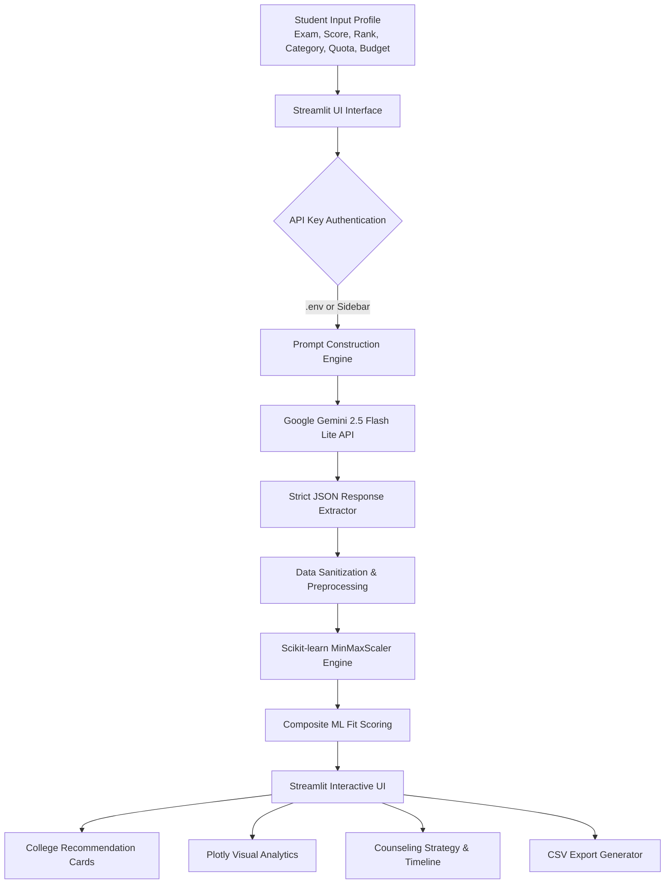

# 🎓 Engineering College Predictor & Counseling Assistant

[](https://www.python.org/)
[](https://streamlit.io/)
[](https://ai.google.dev/)
[](https://scikit-learn.org/)
[](https://plotly.com/)
[](LICENSE)

> **An AI-powered, multi-exam engineering college admission predictor and counseling advisor built with Streamlit, Google Gemini AI, and Scikit-learn.**

---

## 📌 Overview

Every year, millions of Indian engineering aspirants appear for national and state-level entrance examinations (such as JEE Main, JEE Advanced, MHT-CET, COMEDK, KCET, WBJEE, and others). Navigating the counseling processes (JoSAA, CSAB, CAP, KEA) with complex quota systems (Home State vs. All India, Category reservations, Branch cutoffs, Fee structures, and Placement records) is stressful and confusing.

The **Engineering College Predictor** bridges this gap by combining **Google Gemini 2.5 generative reasoning** with **machine learning feature normalization** (MinMaxScaler) to provide candidate-specific, actionable college recommendations across Safe, Moderate, and Ambitious tiers.

---

## ✨ Key Features

- **🎯 Multi-Exam Coverage (10+ Major Exams)**:
  - **National Level**: JEE Main, JEE Advanced, BITSAT
  - **State Level CETs**: MHT-CET (Maharashtra), KCET (Karnataka), WBJEE (West Bengal), KEAM (Kerala), UPCET / AKTU (Uttar Pradesh)
  - **Private / Deemed Universities**: COMEDK, VITEEE
- **🤖 Gemini 2.5 Flash Lite Engine**:
  - Employs tailored admission counselor prompt engineering to evaluate rank, category, quota, gender, and regional constraints.
  - Generates personalized candidate profiles with round-wise expectations and multi-year cutoff trends.
- **📈 ML-Driven Composite Fit Score**:
  - Uses `scikit-learn`'s `MinMaxScaler` to normalize multi-dimensional attributes:
    $$\text{Composite Score} = 0.40 \times \text{Chance} + 0.35 \times \text{Placement} - 0.15 \times \text{Fees} + 0.10 \times \text{Cutoff}$$
  - Ranks options using a 0–100 normalized index reflecting value-for-money and admission probability.
- **📊 Interactive Analytics Dashboard**:
  - **Donut Chart**: Admission chance distribution (High, Medium, Low).
  - **Bar Charts**: College distribution by category/type (IIT, NIT, IIIT, Govt, Private) and average placement packages.
  - **Scatter Plot**: ML Fit score per college vs. admission probability.
- **💡 Counseling Strategies & Insights**:
  - Strategy tips for choice filling (JoSAA, CSAB, State CAP rounds).
  - 3-Year historical cutoff trajectory analysis.
  - Backup alternative entrance exams and counseling timeline tracker.
- **💾 One-Click Data Export**:
  - Export custom recommendations and college metrics directly to a clean CSV file.
- **💎 Sleek Dark Glassmorphism UI**:
  - Built with custom CSS, Google Fonts (`Space Grotesk` & `Sora`), dynamic glowing gradients, and responsive card layouts.

---

## 🏗️ Architecture & Data Flow



---

## 🛠️ Tech Stack

| Domain | Technology / Library | Purpose |
| :--- | :--- | :--- |
| **Framework** | [Streamlit](https://streamlit.io/) | Interactive web application frontend & reactive UI |
| **Generative AI** | [Google Generative AI SDK](https://pypi.org/project/google-generativeai/) | Gemini 2.5 Flash Lite for counseling reasoning |
| **Machine Learning** | [scikit-learn](https://scikit-learn.org/) | `MinMaxScaler` multi-criteria decision normalization |
| **Data Processing** | [Pandas](https://pandas.pydata.org/) & [NumPy](https://numpy.org/) | Dataframe manipulation, data cleaning, and CSV exports |
| **Data Visualization** | [Plotly Express](https://plotly.com/python/) | Interactive charts, distribution donuts, and scatter plots |
| **Styling** | Vanilla CSS3 (Glassmorphism) | Dark theme gradient backgrounds, badges, and animations |
| **Environment** | [python-dotenv](https://pypi.org/project/python-dotenv/) | Secure API credential management |

---

## 📁 Repository Structure

```text
College-Predictor-/
├── .env                  # Environment configuration (API keys)
├── .env.example          # Environment template for new users
├── app.py                # Main Streamlit web application & ML logic
├── requirements.txt      # Project dependencies for pip installation
├── extension.txt        # Legacy extension package list
├── README.md             # Project documentation & guide
└── PROJECT_REPORT.md     # Comprehensive academic & technical report
```

---

## 🚀 Quickstart Guide

### 1. Clone the Repository
```bash
git clone https://github.com/akashchavan7913/College-Predictor-.git
cd College-Predictor-
```

### 2. Set Up a Virtual Environment (Recommended)
```bash
# Windows (PowerShell)
python -m venv venv
.\venv\Scripts\activate

# macOS / Linux
python3 -m venv venv
source venv/bin/activate
```

### 3. Install Dependencies
```bash
pip install -r requirements.txt
```

### 4. Configure Your Gemini API Key
Get a free Gemini API key from [Google AI Studio](https://aistudio.google.com/app/apikey).

Create or modify your `.env` file in the project root:
```env
GEMINI_API_KEY=your_actual_gemini_api_key_here
```
*(Alternatively, enter your API key directly in the application sidebar when the app starts).*

### 5. Launch the Application
```bash
streamlit run app.py
```
The application will automatically launch in your default browser at:
`http://localhost:8501`

---

## 💻 How to Use

1. **Enter API Key**: Provide your Google Gemini API Key via `.env` or input it directly in the sidebar.
2. **Select Exam**: Choose from JEE Main, JEE Advanced, MHT-CET, COMEDK, KCET, WBJEE, KEAM, VITEEE, BITSAT, or UPCET.
3. **Fill Candidate Profile**:
   - Score / Marks and Rank (CRL or Category Rank).
   - Category (General, OBC-NCL, SC, ST, EWS, etc.).
   - Home State (critical for home-state quota calculations).
   - 12th Board Percentage and preferred engineering branch.
   - Maximum annual budget (in ₹ Lakhs).
4. **Click "🚀 Predict My Colleges"**:
   - Review AI-curated college cards sorted by the **ML Fit Score**.
   - Check admission probabilities (**High**, **Medium**, **Low**).
   - Explore **Visual Analytics**, **Counseling Strategy Tips**, and **Historical Cutoff Trends**.
5. **Download CSV**: Click **📥 Download Predictions as CSV** to save your customized report.

---

## 🧮 Machine Learning Scoring Methodology

While the Large Language Model generates realistic candidate predictions based on historical cutoffs and criteria, our ML post-processing engine calculates an objective **Fit Score** using feature normalization:

1. **Feature Extraction**:
   - $C_{raw}$: Cutoff Score
   - $F_{raw}$: Annual Tuition Fees
   - $P_{raw}$: Average Placement Package (LPA)
   - $A_{raw}$: Admission Probability mapped to integer scale ($\text{High}=3, \text{Medium}=2, \text{Low}=1$)
2. **Feature Normalization**:
   $$X_{norm} = \frac{X - X_{min}}{X_{max} - X_{min}}$$
3. **Multi-Attribute Utility Weighting**:
   $$\text{Composite} = 0.40 \cdot A_{norm} + 0.35 \cdot P_{norm} - 0.15 \cdot F_{norm} + 0.10 \cdot C_{norm}$$
4. **Final Scoring**:
   $$\text{ML Fit Score} = \text{round}(\text{Composite} \times 100, 1)$$

This penalizes excessively high fees while rewarding high admission probability, higher average packages, and reputable cutoffs.

---

## 🛡️ Troubleshooting

- **Quota Exceeded (HTTP 429 / RESOURCE_EXHAUSTED)**:
  - Google Gemini free tier has rate limits per minute. Wait 60 seconds and retry, or use a new key from Google AI Studio.
- **ModuleNotFoundError**:
  - Verify your virtual environment is active and run `pip install -r requirements.txt`.
- **State Selection Warning**:
  - Ensure you enter your **Home State** in the sidebar, as reservation quotas (e.g., 85% Home State quota in state colleges) depend on it.

---

## 📄 License

This project is licensed under the [MIT License](LICENSE) - feel free to use, modify, and distribute for educational and personal purposes.

---

## 👨‍💻 Authors & Acknowledgments

- **Akash Chavan** ([@akashchavan7913](https://github.com/akashchavan7913))
- Built with [Streamlit](https://streamlit.io/) and powered by [Google Gemini AI](https://ai.google.dev/).
